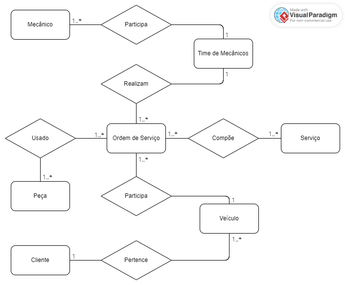
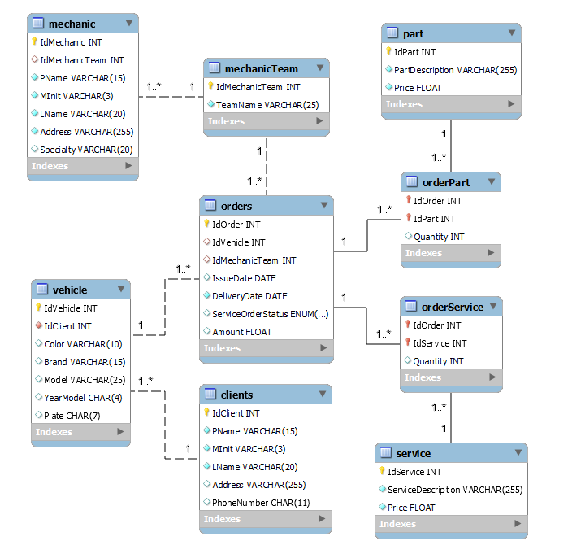
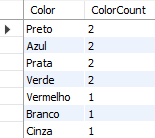
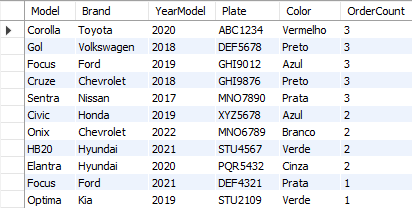
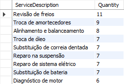
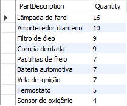
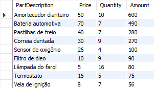

# AutoWorkshop - SQL - DIO Challenge

## Proposta

### Parte 1 - Construir um Esquema Conceitual para Banco de Dados

A partir da narrativa fornecida você será capaz de criar todas as entidades, relacionamentos e atributos.

**Narrativa:**

- Sistema de controle e gerenciamento de execução de ordens de serviço em uma oficina mecânica
- Clientes levam veículos à oficina mecânica para serem consertados ou para passarem por revisões  periódicas
- Cada veículo é designado a uma equipe de mecânicos que identifica os serviços a serem executados e preenche uma OS com data de entrega.
- A partir da OS, calcula-se o valor de cada serviço, consultando-se uma tabela de referência de mão-de-obra
- O valor de cada peça também irá compor a OSO cliente autoriza a execução dos serviços
- A mesma equipe avalia e executa os serviços
- Os mecânicos possuem código, nome, endereço e especialidade
- Cada OS possui: n°, data de emissão, um valor, status e uma data para conclusão dos trabalhos.

### Parte 2 - Constrir um Projeto Lógico de Banco de Dados do Zero

Nesta etapa, você definirá desde o esquema até a implementação do banco de dados. Após a criação do **esquema lógico**, realize a criação do **Script SQL** para criação do esquema do banco de dados. Posteriormente, realize a persistência de dados para **realização de testes**. Especifique ainda **queries** mais complexas do que apresentadas durante a explicação do desafio. Sendo assim, crie queries SQL com as cláusulas abaixo:

- Recuperações simples com SELECT Statement;
- Filtros com WHERE Statement;
- Crie expressões para gerar atributos derivados;
- Defina ordenações dos dados com ORDER BY;
- Crie junções entre tabelas para fornecer uma perspectiva mais complexa dos dados.

## Execução do Desafio

### Parte 1

#### Diagrama MER

Este modelo de entidade e relacionamento fornece uma visão geral dos dados e relacionamentos necessários para um **sistema de gerenciamento de serviços mecânicos**.

As seguintes entidades são definidas no modelo: **Mecânico, Time de Mecânicos, Ordem de serviço, Serviço, Peça, Veículo, Cliente**

Relacionamentos:

* **Participa:** Um mecânico participa de um time, um time pode ter mais de um mecânico (N:1).
* **Realizam:** Um Time realiza uma ou mais Ordens de Serviço, cada ordem é realizada por um time (1:N).
* **Usado:** Uma ou mais peças são usadas em uma ou mais Ordens de Serviço (N:M).
* **Compõe:** Um ou mais serviços compõem uma ou mais Ordens de Serviço (N:M).
* **Pertence:** Um veículo pertence a um cliente, um cliente pode ter um ou mais veículos (N:1).
* **Participa:** Um veículo participa de uma ou mais Ordens de serviço (1:N).

### Parte 2

#### Diagrama EER

O diagrama EER acima mostra como cada entidade como tabela e também os relacinamentos N:M. Cada tabela tem seus atributos, que descrevem as informações relevantes, e estão tipados de acordo com a informação que será armazenada. 

Há ainda as chaves primárias, simples e compostas, além das chaves estrangeiras, no topo de cada tabela, indicando como a relação será 'vinculada' no esquema SQL, orientando assim a criação do Banco de Dados através de comando MySQL DDL.

## Perguntas abordadas nas [queries DML](autoworkshop_dml_queries.sql)

- Qual a quantidade de clientes?

    

- Quantos veículos cada cliente tem?

    

- Quantas Ordens de Serviço foram pedidas por cada cliente?

    

- Qual a quantidade de veículos registrados?

    

- Qual a cor de veículo mais usada?

    

- Quantas Ordens de Serviço foram registradas para cada veículo?

    

- Quantos mecânicos trabalham na oficina?

    

- Quantos mecânicos estão dispostos em cada time?

    

- Quantos mecânicos temos por especilidade?

    

- Quantos serviços são oferecidos?

    

- Quais os serviços mais solicitados?

    

- Qual a receita obtida com cada serviço?

    

- Quais as peças mais usadas?

    

- Qual a receita obitida com cada peça?

    

- Qual a quantidade de Ordens de serviço por Status?

    

- Quantas Ordens de Serviço 'Em Progresso' estão atribuídas a cada time?

    

- Quanta receita cada Ordem de Serviço 'Concluída' gerou com peças?

    

- Quanta receita cada Ordem de Serviço 'Concluída' gerou com serviços?

    

## Author

### Wanderson G. Fernandes
- [Instagram](https://instagram.com/locke._.wanderson?igshid=ZDc4ODBmNjlmNQ==)
- [LinkedIn](https://www.linkedin.com/in/wanderson-guedes-3138851aa)

## 📝 Licença

Esse projeto está sob licença MIT. Veja o arquivo [LICENÇA](LICENSE.md) para mais detalhes.
